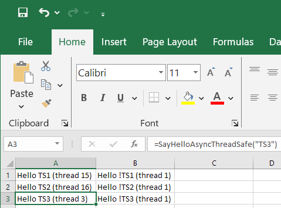

AsyncThreadSafe sample
---

Demonstrates that `ExcelAsyncUtil.Run` can be used in a thread safe Excel function.

By default, Excel functions are executed on the main UI thread. You can use the `IsThreadSafe` attribute to mark a function that supports execution on a worker thread and use `ExcelAsyncUtil.Run` from it for asynchronous execution: 

```c#

[ExcelFunction(IsThreadSafe = true)]
public static object SayHelloAsyncThreadSafe(string name)
{
    return SayHelloAsync(nameof(SayHelloAsyncThreadSafe), name);
}

private static object SayHelloAsync(string callerFunctionName, string name)
{
    int threadId = Thread.CurrentThread.ManagedThreadId;
    return ExcelAsyncUtil.Run(callerFunctionName, new object[] { name }, () => SayHelloWithDelay(name, threadId));
}

private static string SayHelloWithDelay(string name, int threadId)
{
    Thread.Sleep(2000);
    return $"Hello {name} (thread {threadId})";
}

```

Adding several calls to `SayHelloAsyncThreadSafe` and `SayHelloAsyncNotThreadSafe` to a worksheet and pressing `Ctrl+Alt+F9` for recalculation demonstrates that thread safe functions are executed on worker threads and not thread safe functions are executed on the main UI thread:

```

=SayHelloAsyncThreadSafe("TS")
=SayHelloAsyncNotThreadSafe("!TS")

```



The sample project also includes `SayHelloAsyncFast` thread safe function that uses `ExcelAsyncUtil.Run` and returns immediately without any delay. And `SayHelloAsyncSlow` thread safe function that uses `ExcelAsyncUtil.Run` and returns a value after 10 seconds delay:

```c#

[ExcelFunction(IsThreadSafe = true)]
public static object SayHelloAsyncFast(string name)
{
    return ExcelAsyncUtil.Run(nameof(SayHelloAsyncFast), new object[] { name }, () => $"Hello {name}");
}

[ExcelFunction(IsThreadSafe = true)]
public static object SayHelloAsyncSlow(string name)
{
    return ExcelAsyncUtil.Run(nameof(SayHelloAsyncSlow), new object[] { name }, () => SayHelloWithDelay10(name));
}

private static string SayHelloWithDelay10(string name)
{
    Thread.Sleep(10000);
    return $"Hello {name}";
}

```

You can test them like this:

```

=SayHelloAsyncFast("fast")
=SayHelloAsyncSlow("slow")

```

